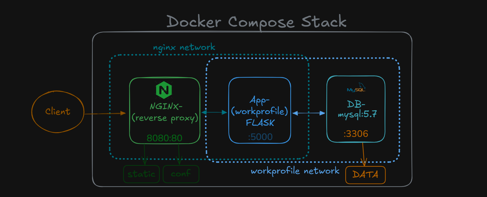

# WorkProfile Application

## Overview

WorkProfile is a production-ready multi-tier web application built with Flask and MySQL. It is designed for deployment on Kubernetes with a CI/CD pipeline that automates building, testing, pushing Docker images to GitHub Container Registry (GHCR), and deploying to Kubernetes clusters including kind and Killercoda environments.

---

## Architecture
# Three-tier Architecture




### Components

- **WorkProfile Flask Application**
  - Python 3.10 based backend serving HTTP endpoints.
  - Contains unit and end-to-end (E2E) tests to ensure functionality and stability.
  - Uses ConfigMaps for configuration management.

- **MySQL StatefulSet**
  - Persistent MySQL database with 2Gi volume storage.
  - Initialized with secure Kubernetes Secrets for credentials.
  - Uses ConfigMap for initialization SQL scripts.
  - Persistent Volume Claims (PVC) for data durability.

- **Docker and GHCR**
  - Docker images built and tagged semantically (e.g., v1.0.27).
  - Images pushed to GHCR for versioning and distribution.

- **Kubernetes Deployment**
  - Uses Deployments and StatefulSets with resource limits.
  - Health checks with liveness and readiness probes.
  - Services expose WorkProfile with NodePort for external access.
  - Secrets and ConfigMaps manage sensitive data and config.

- **CI/CD Pipeline (GitHub Actions)**
  - **build-test**: Runs unit tests and tags the Docker image.
  - **e2e-tests**: Runs integration tests on full stack using Docker Compose.
  - **push-image**: Builds and pushes Docker images to GHCR and creates GitHub Releases.
  - **deploy-k8s**: Creates kind cluster, deploys MySQL and WorkProfile to Kubernetes, verifies deployments, and outputs manual deployment instructions.

---

## Setup and Usage

### Prerequisites

- Kubernetes cluster (or use kind for local testing)
- kubectl CLI installed and configured
- Docker and Docker Compose installed locally for E2E testing
- GitHub repository with configured secrets:  
  - `GITHUB_TOKEN`  
  - `GHCR_TOKEN` (for GHCR push authentication)

### Running Locally with Docker Compose

1. Clone the repository  
2. Run `docker-compose up -d --build` to start full stack (WorkProfile + MySQL)  
3. Access application endpoints on `http://localhost:8080/`  
4. Run tests in `tests/e2e_tests.py`  

---

## CI/CD Pipeline Details

The GitHub Actions workflow consists of the following jobs:

### build-test

- Checks out code, sets up Python 3.10
- Installs dependencies and runs unit tests  
- Generates semantic image tag `v1.0.{run_number}`

### e2e-tests

- Sets up Python environment and installs dependencies
- Installs Docker Compose on runner
- Starts full stack with Docker Compose and waits for readiness
- Tests root `/` and `/health` endpoints via `curl`
- Runs Python E2E tests
- Stops and cleans Docker environment

### push-image

- Logs into GitHub Container Registry (GHCR)
- Builds Docker image tagged as `latest` and semantic version
- Pushes images to GHCR
- Creates a GitHub Release with autogenerated notes

### deploy-k8s

- Installs kind and creates a local Kubernetes cluster
- Creates Docker image pull secrets for GHCR authentication
- Deploys MySQL StatefulSet, Service, and related resources
- Deploys WorkProfile Deployment, Service, and ConfigMap
- Waits for resources to become ready
- Verifies overall cluster status, Secrets, ConfigMaps, and connectivity
- Runs port-forwarding for WorkProfile application test
- Checks resource limits on pods
- Displays comprehensive deployment instructions including manual deployment to Killercoda

---

## Manual Deployment to Killercoda

To deploy manually on Killercoda environment:

1. Clone repository and prepare:  
    ```bash
    git clone https://github.com/cg865/WorkProfile.git
    cd WorkProfile
    sed -i 's|IMAGE_PLACEHOLDER|ghcr.io/cg865/workprofile:<tag>|g' k8s/workprofile-deployment.yaml
    ```

2. Deploy MySQL infrastructure:
    ```bash
    kubectl apply -f k8s/mysql-secret.yaml
    kubectl create configmap mysql-initdb-config --from-file=init.sql=init.sql
    kubectl apply -f k8s/mysql-statefulset.yaml
    kubectl apply -f k8s/mysql-service.yaml
    kubectl wait --for=condition=ready pod/mysql-0 --timeout=300s
    ```

3. Deploy WorkProfile application:
    ```bash
    kubectl apply -f k8s/workprofile-configmap.yaml
    kubectl apply -f k8s/workprofile-deployment.yaml
    kubectl apply -f k8s/workprofile-service.yaml
    kubectl wait --for=condition=available deployment/workprofile --timeout=300s
    ```

4. Access the application:
    ```bash
    kubectl get service workprofile-service
    ```
    # Note the NodePort (30000-32767 range)
    # Use Killercoda Traffic Port Accessor with that port

5. Test production features:

- Test MySQL connectivity:
    ```bash
    kubectl run mysql-client --image=mysql:5.7 -it --rm --restart=Never -- \
    mysql -h mysql-service -u flaskapp -pflaskapp -D exampleDb -e "SHOW DATABASES;"
    ```

- Test data persistence:
    ```bash
    kubectl delete pod mysql-0
    kubectl wait --for=condition=ready pod/mysql-0 --timeout=300s
    ```
    # Verify your data still exists

- Check resource limits and probes:
    ```bash
    kubectl describe pod -l app=workprofile
    ```

**Screenshot of Killercoda Deployment Terminal**  
  


### Additional Notes
- The CI/CD pipeline uses semantic versioning with the tag format: v1.0.<run_number>

- All credentials are securely stored in Kubernetes Secrets, never in plain text.

- Resource limits ensure predictable app behavior under load.

- Health checks guarantee high availability and automatic recovery from failures.

- The kind cluster enables realistic integration testing before production deployment.

## Contact and Contribution
For questions or contributions, please open issues or pull requests on GitHub.


